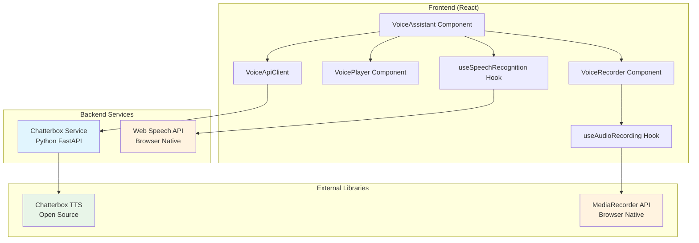
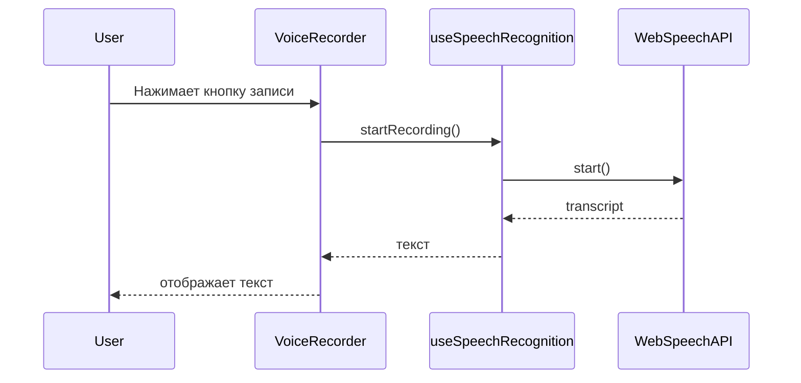
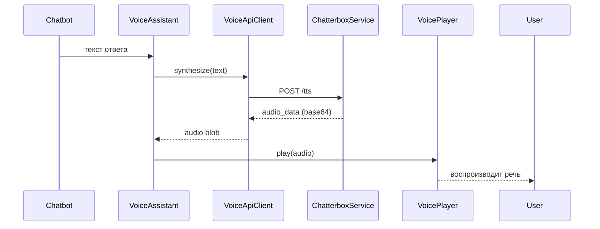

# Voice Assistant Architecture

## Обзор

Голосовой ассистент для volleyball проекта использует **полностью бесплатное решение** на основе open-source Chatterbox для Text-to-Speech и Web Speech API для Speech-to-Text.

## Архитектурная диаграмма



## Компонентная структура

### Frontend Components

```
src/components/chatbot/voice/
├── ui/
│   ├── VoiceAssistant/
│   │   ├── index.tsx              # Экспорт компонента
│   │   └── VoiceAssistant.tsx     # Главный контейнер
│   ├── VoiceRecorder/
│   │   ├── index.tsx              # Экспорт компонента
│   │   ├── VoiceRecorder.tsx     # UI записи
│   │   └── AudioVisualizer.tsx    # Визуализация аудио
│   └── VoicePlayer/
│       ├── index.tsx              # Экспорт компонента
│       ├── VoicePlayer.tsx        # UI воспроизведения
│       └── AudioControls.tsx      # Контролы аудио
├── hooks/
│   ├── useAudioRecording.ts       # Запись аудио
│   ├── useSpeechRecognition.ts    # Распознавание речи
│   └── useTextToSpeech.ts         # Синтез речи
├── api/
│   ├── VoiceApiClient.ts          # HTTP клиент
│   └── voiceApi.types.ts          # Типы API
├── types/
│   └── voice.types.ts             # Общие типы
├── lib/
│   ├── constants.ts               # Константы
│   └── utils.ts                   # Утилиты
└── index.ts                       # Barrel export
```

### Backend Service

```
chatterbox-service/
├── main.py              # FastAPI сервер
├── requirements.txt     # Python зависимости
└── Dockerfile          # Docker контейнер
```

## Потоки данных

### 1. Speech-to-Text Flow



### 2. Text-to-Speech Flow



## Технологический стек

### Frontend
- **React 18** - UI компоненты
- **TypeScript** - Строгая типизация
- **MediaRecorder API** - Запись аудио
- **Web Speech API** - Распознавание речи
- **TailwindCSS** - Стили

### Backend
- **Python 3.11** - Runtime
- **FastAPI** - Web framework
- **Chatterbox TTS** - Open-source TTS
- **PyTorch** - ML framework для Chatterbox
- **Docker** - Контейнеризация

## Безопасность и приватность

### Локальная обработка
- **Chatterbox Service** работает локально
- **Никаких API ключей** не требуется
- **Аудио данные не покидают** инфраструктуру

### Browser Security
- **HTTPS обязательный** для MediaRecorder API
- **User permission** для доступа к микрофону
- **Local storage** для настроек (без персональных данных)

### GDPR Compliance
- **Явное согласие** на использование микрофона
- **Локальная обработка** без передачи данных третьим лицам
- **Право на удаление** - очистка localStorage

## Производительность

### Требования
- **Latency < 2s** для TTS генерации
- **Memory < 500MB** для Chatterbox модели
- **CPU < 2 cores** для FastAPI сервиса

### Оптимизации
- **Lazy loading** Chatterbox модели
- **Audio caching** для повторных фраз
- **Connection pooling** для HTTP запросов
- **Debouncing** для записи аудио

## Browser Compatibility

| Feature | Chrome | Firefox | Safari | Edge |
|---------|--------|---------|--------|------|
| MediaRecorder API | ✅ | ✅ | ✅ | ✅ |
| Web Speech API | ✅ | ❌ | ✅ | ✅ |
| Chatterbox TTS | ✅ | ✅ | ✅ | ✅ |

## Deployment

### Development
```bash
# Frontend
npm run dev

# Backend (Chatterbox Service)
cd chatterbox-service
pip install -r requirements.txt
python main.py
```

### Production
```bash
# Frontend
npm run build

# Backend
docker build -t chatterbox-service .
docker run -p 8000:8000 chatterbox-service
```

## Мониторинг и логирование

### Health Checks
- `/health` endpoint для Chatterbox Service
- `navigator.mediaDevices` для микрофона
- `SpeechRecognition` для STT поддержки

### Logging
- **Frontend**: Console логи с уровнями
- **Backend**: Structured logging с JSON
- **Без логирования** аудио данных (privacy)

## Fallback стратегия

### Если Chatterbox недоступен
- **Web Speech API** для TTS (если поддерживается)
- **Только текстовый ввод** как fallback

### Если микрофон недоступен
- **Текстовый ввод** через клавиатуру
- **Voice commands** отключены

## Будущие улучшения

### Phase 2 Features
- **Voice Cloning** с аудио сэмплами
- **Real-time streaming** для низких задержек
- **Multi-voice** поддержка
- **Emotional TTS** с парадингвистическими тегами

### Phase 3 Features
- **Voice Activity Detection** для авто-стоп
- **Noise Reduction** для чистого аудио
- **Personalized voices** для пользователей
- **Cloud sync** настроек между устройствами
