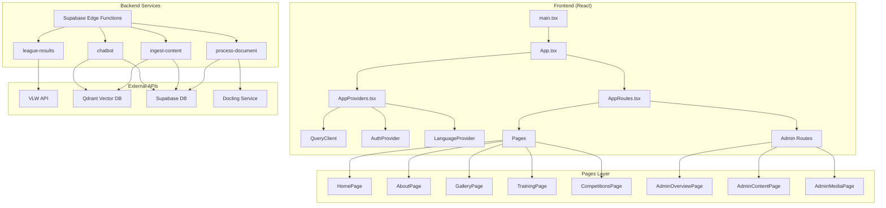
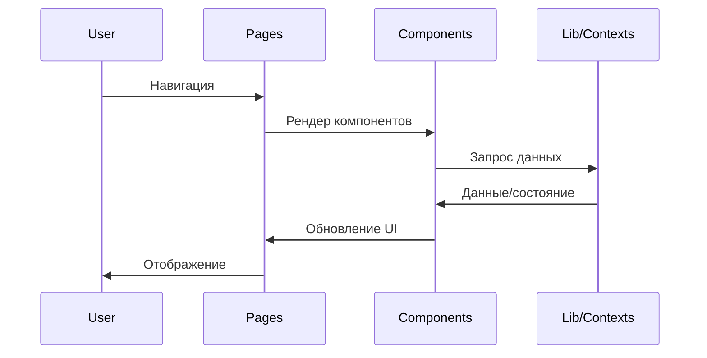
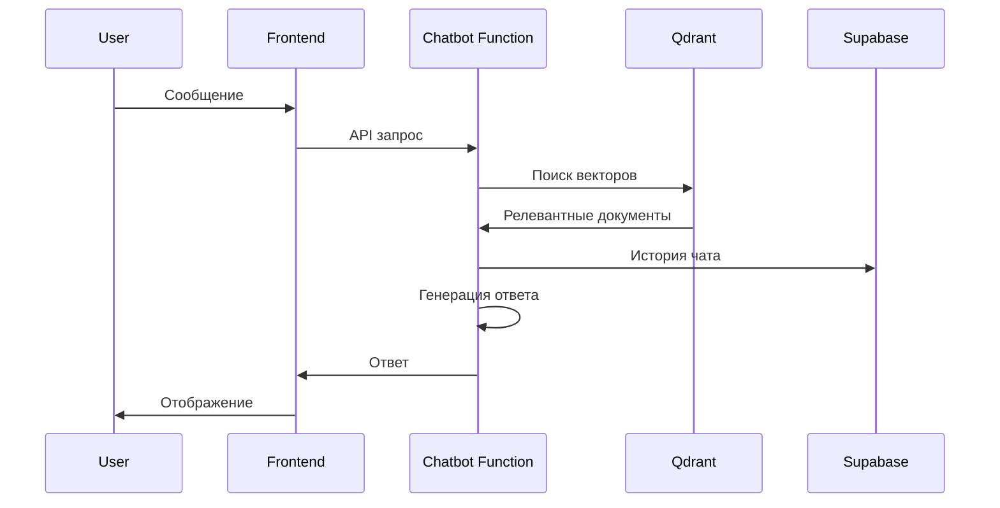
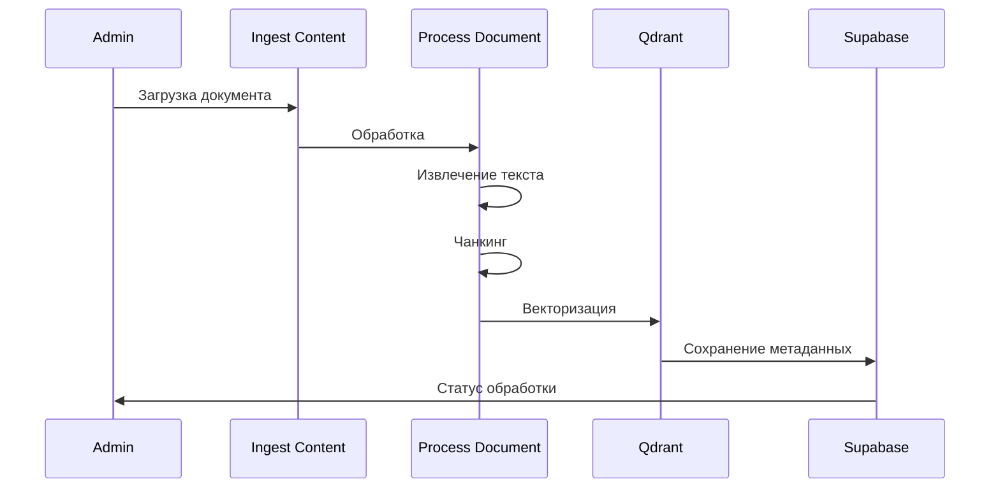
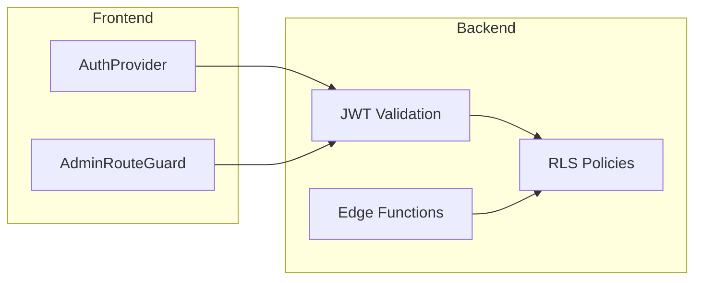
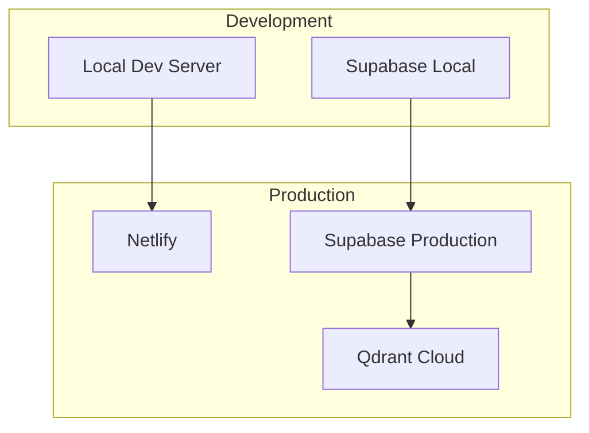

# Code Map - Volleyball ZZH Project Architecture

## 🏗️ Общая архитектура проекта



## 📁 Структура директорий

### Frontend (`src/`)
```
src/
├── components/          # UI компоненты
│   ├── admin/          # Админ-панель компоненты
│   ├── gallery/        # Галерея компоненты
│   └── ui/             # Базовые UI элементы
├── pages/              # Страницы приложения
│   └── admin/          # Админ-страницы
├── lib/                # Утилиты и контексты
├── routes/             # Роутинг
├── types/              # TypeScript типы
└── data/               # Статические данные
```

### Backend (`supabase/functions/`)
```
supabase/functions/
├── chatbot/            # AI чат-бот с RAG
├── ingest-content/     # Обработка контента
├── league-results/     # Результаты лиги (VLW API)
└── process-document/   # Обработка документов
```

## 🔄 Потоки данных

### 1. Пользовательский интерфейс


### 2. Чат-бот с RAG


### 3. Обработка контента


## 🎯 Ключевые зависимости

### Frontend зависимости
- **React 18** - UI фреймворк
- **React Router** - Навигация
- **TanStack Query** - Управление состоянием сервера
- **Supabase JS** - Клиент Supabase
- **TailwindCSS** - Стили

### Backend зависимости
- **Supabase Edge Runtime** - Serverless функции
- **Qdrant Client** - Векторная база данных
- **Docling** - Обработка документов
- **VLW API** - Данные волейбольной лиги

## 🔐 Архитектура безопасности



## 📊 Административная панель

### Модули админки:
- **Overview** - Общая статистика
- **Content** - Управление контентом
- **Media** - Медиа файлы
- **Albums** - Фотоальбомы
- **Vector Jobs** - Задачи векторизации
- **Chats** - История чатов

## 🚀 Деплоймент и инфраструктура



## 🔧 Конфигурация

### Переменные окружения:
- `VITE_SUPABASE_URL` - URL Supabase
- `VITE_SUPABASE_ANON_KEY` - Анонимный ключ
- `VLW_API_KEY` - API ключ волейбольной лиги
- `QDRANT_URL` - URL векторной БД

## 📈 Масштабирование

### Горизонтальное масштабирование:
- **Edge Functions** - Автоматическое масштабирование
- **CDN** - Статические ресурсы
- **Database Pooling** - Подключения к БД

### Вертикальное масштабирование:
- **Code Splitting** - Ленивая загрузка
- **Caching** - React Query кэш
- **Vector Search Optimization** - Индексация Qdrant

---

*Сгенерировано автоматически для анализа архитектуры проекта*
