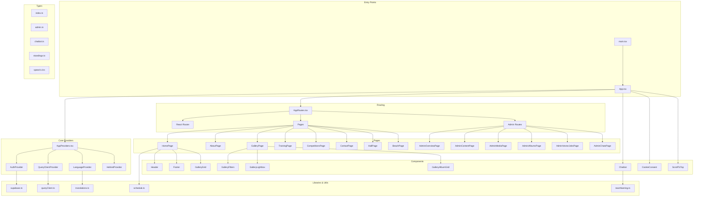
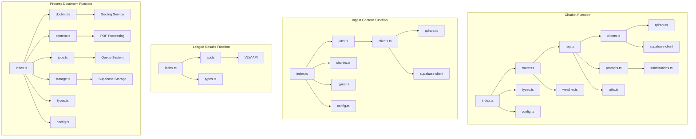
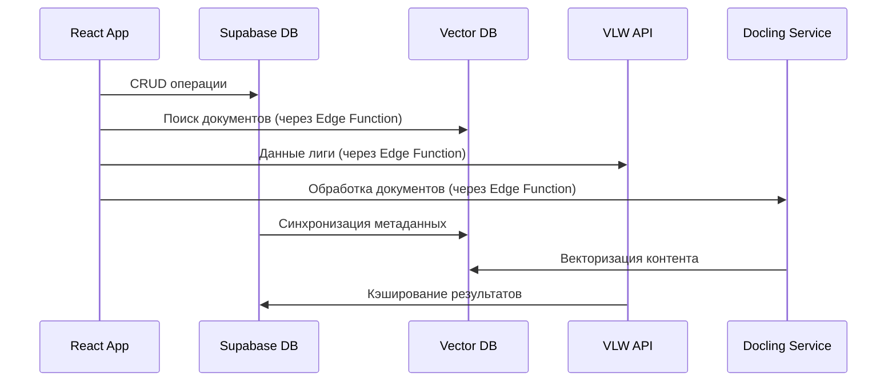
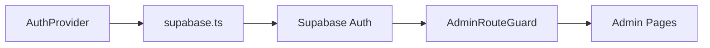
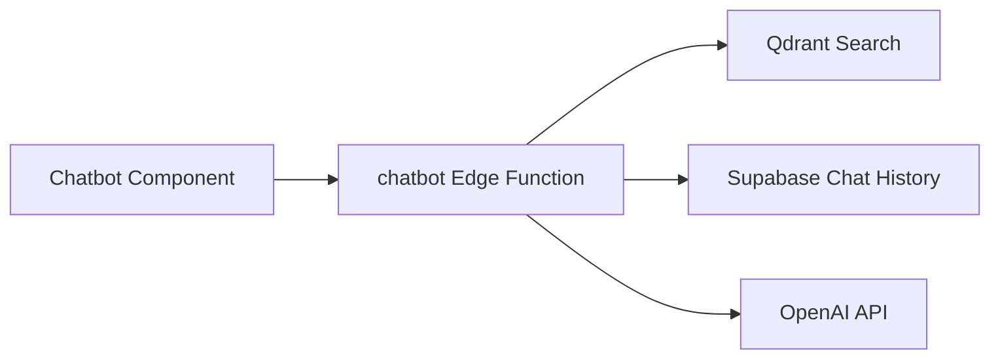
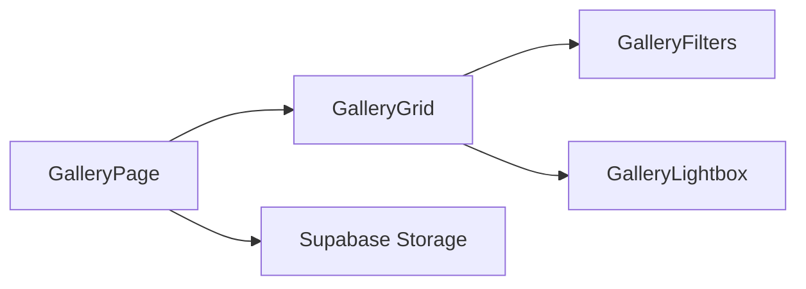
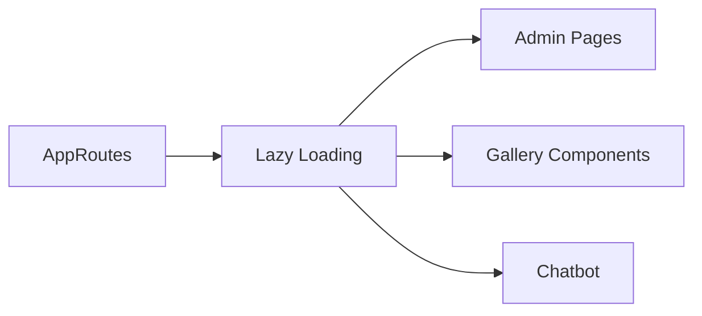
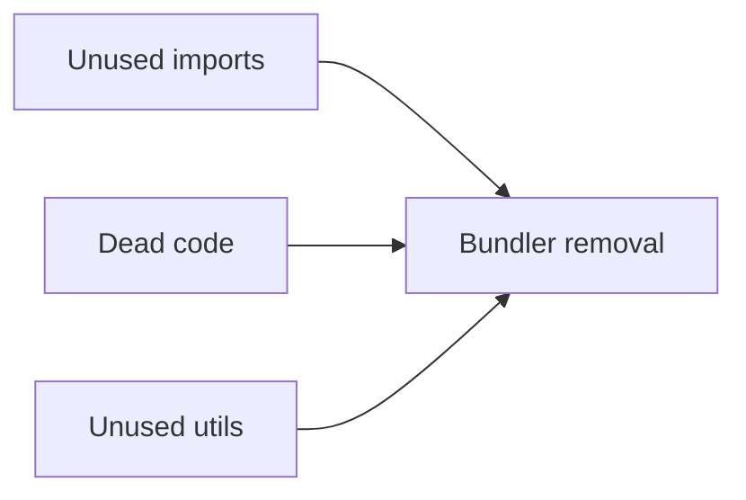
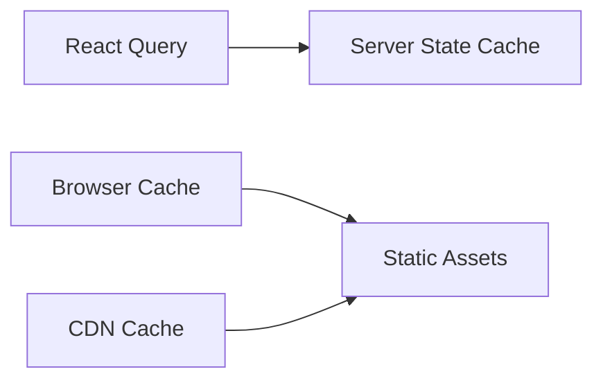

# Code Map - Dependencies Graph

## 🔗 Граф зависимостей модулей

### Frontend зависимости


### Backend зависимости (Edge Functions)


## 📦 Пакетные зависимости

### Core Dependencies
```mermaid
graph LR
    subgraph "React Ecosystem"
        A[react] --> B[react-dom]
        A --> C[react-router-dom]
        A --> D[react-helmet-async]
        A --> E[@tanstack/react-query]
    end
    
    subgraph "UI & Styling"
        F[tailwindcss] --> G[autoprefixer]
        F --> H[postcss]
        I[lucide-react] --> J[clsx]
        I --> K[tailwind-merge]
    end
    
    subgraph "Backend Clients"
        L[@supabase/supabase-js] --> M[@supabase/auth-helpers-react]
        N[qdrant-js] --> O[axios]
        P[docling] --> Q[python service]
    end
```

### Dev Dependencies
```mermaid
graph LR
    subgraph "Build Tools"
        A[vite] --> B[@vitejs/plugin-react]
        A --> C[typescript]
        A --> D[eslint]
        A --> E[postcss]
    end
    
    subgraph "Testing"
        F[vitest] --> G[@testing-library/react]
        F --> H[@testing-library/jest-dom]
    end
    
    subgraph "Code Quality"
        I[eslint] --> J[@typescript-eslint/eslint-plugin]
        I --> K[eslint-plugin-react-hooks]
        I --> L[eslint-plugin-react-refresh]
    end
```

## 🔄 Потоки данных между сервисами



## 🎯 Критические пути зависимостей

### 1. Аутентификация


### 2. Чат-бот RAG


### 3. Галерея


## ⚠️ Потенциальные проблемы зависимостей

### Циклические зависимости
- **Отсутствуют** - проект спроектирован с однонаправленными зависимостями

### Сильная связанность
- **App.tsx** → множество компонентов (нормально для корневого компонента)
- **AdminRouteGuard** → конкретные админ страницы (нормально для безопасности)

### Слабые места
- **Edge Functions** → внешние API (VLW, Docling) - требует обработки ошибок
- **Qdrant клиент** → зависимость от внешней службы - нужен fallback

## 🔧 Оптимизация зависимостей

### Code Splitting


### Tree Shaking


### Caching Strategy


---

*Сгенерировано автоматически для анализа зависимостей проекта*
